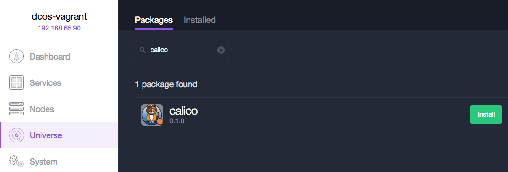
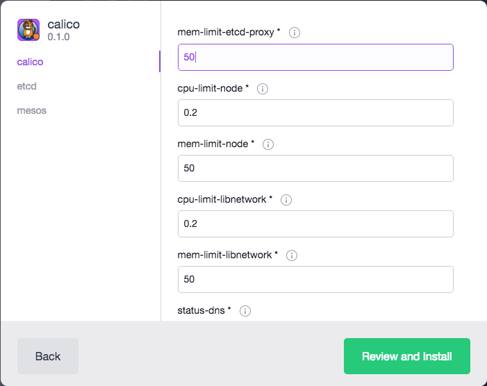

---
---
<!--- master only -->
>  This document applies to the HEAD of the calico-containers source tree.
>
> View the calico-containers documentation for the latest release [here](https://github.com/projectcalico/calico-containers/blob/v0.19.0/index).
<!--- else
> You are viewing the calico-containers documentation for release **release**.
<!--- end of master only -->

# Installing Calico in DC/OS
This guide provides instructions for installing Calico and its
prerequisites on a [Mesos DC/OS](https://dcos.io/) cluster.

##Prerequisites

### Mesos Master and Agents

You will need to be running a cluster with at least one Mesos master
and and at least one Mesos agent (though we recommend having two or
more agents).

You can set up a cluster fairly easily by following the [DC/OS Vagrant Install guide]
(https://github.com/dcos/dcos-vagrant). It is important to note that
if you install from this vagrant script, the Docker version on the machines
will be insufficient, so you will need to upgrade to Docker 1.9 or above ***before*** launching the Calico service.

We currently support DC/OS `1.7` (with Mesos `0.28.1`).
We support Centos7 and CoreOS as operating systems for use with
the Unified Containerizer and Docker Containerizer.

### Etcd
Calico requires an etcd datastore. A service discovery URL is required
to access the datastore, which can be configured in the Calico service's
Advanced Install options.

You can quickly spin up an etcd cluster using ths DCOS Universe
package as follows (Calico is configured to use the default service discovery URL in this install, so you won't need to edit this URL in the Calico config):
 - Go to the **Universe** tab in your DC/OS UI.
 - Find the **etcd** package
 - Click the **Install** button
 - (Optional) choose **Advanced Installation** from
the pop-up window.
	- In non-production environments used for testing, you might have
	  extremely limited resources available on each host (this is
      certainly the case for the DCOS vagrant install), so you may want to set all of
      the **mem** options to use 50MB or lower (this includes
      `mem` and `mem-limit`).
 - Choose **Review and Install**
 - Double-check configuration then click **Install**.

You can check the status of etcd by visiting the **Services**
tab. You can install Calico once etcd appears with a status
of **`Healthy`** (note that this could take a few minutes).

### Mesos-DNS
Calico is compatible with Mesos-DNS, but requires a minor configuration change to preferentially resolve to a container's IP address instead of resolving to its host's. Follow these steps on each master in your cluster to allow containers to be resolvable via their containerized IP: 

1. Open `/opt/mesosphere/etc/mesos-dns.json` with any text editor.
2. Find the line that reads: `"IPSources": ["host", "netinfo"]`
3. Reverse the order of those two fields: `"IPSources": ["netinfo", "host"]`
4. Restart mesos-dns with: `sudo systemctl restart dcos-mesos-dns`

## Install Calico
You can easily install Calico from within the DCOS UI.

### Install Calico Package
You can now install the Calico package from the **Universe**
tab. To start the install:
 - Go to the **Universe** tab
 - Find the Calico package
 - Click the **Install** button then choose **Advanced
   Installation** in the pop-up window.

##### At this point you have a few options:

In non-production environments used for testing, you might have
extremely limited resources available on each host (this is
certainly the case for the DCOS vagrant install), so you may want to set all of
the **mem** options to use 50MB or lower, as seen in the image below. This will
ensure that smaller tasks with low memory requirements
will be scheduled immediately. The changes include
modifying `mem-limit-framework`, `mem-limit-install`,
`mem-limit-etcd-proxy`, `mem-limit-node`, and
`mem-limit-libnetwork`.

You could also speed up the install by increasing
`max-concurrent-restarts`, allowing Calico to restart
the Mesos agent and Docker services on more than one
agent at a time. **NOTE: This is not generally recommended,
but it is fine if you're bringing up a new system.**

##### After configuring the options:

Click **Review and Install**, double-check your
configuration settings, then choose **Install**.

Calico will now begin installation on your cluster.

### Check Calico Status
It will take a few minutes for Calico to finish
installing on your cluster.

Calico runs the following tasks on each agent:
 - Configure an Etcd proxy
 - Install Docker multi-host networking
 - Install Mesos net-modules
 - Run the `calico-node` Docker image
 - Run the `calico-libnetwork` Docker image

You can check the status of each process on each agent
by visiting Calico's status web interface:

 - Go to the **Services** tab
 - Find Calico in the list of running services
   (note that it may take a few minutes for Calico
    to appear).
 - Once the Calico service is `Healthy`, click the
   square pop-out icon next to the service name to
   open the Calico status page in a new tab.

You should see a page that looks like the following:

The webpage may fail to load initially since the Calico
service restarts the Docker and Mesos agent services, which
will cause a restart of the Calico framework when it happens
on the same agent. This is expected and nothing to be
concerned about. Once the status page is running, you will see a
table where each row represents an agent, including statuses
for each of the Calico components installed.

## Next Steps
Once all of the Calico components are installed and
running, you can start launching tasks with your
Mesos cluster.

Get started by checking out our user guides for
the [Docker Containerizer](./UsageGuideDockerContainerizer)
or the [Unified Containerizer](./UsageGuideUnifiedContainerizer),
or to learn more about the differences between the
two containerizers, check out our [Mesos README](./README).

